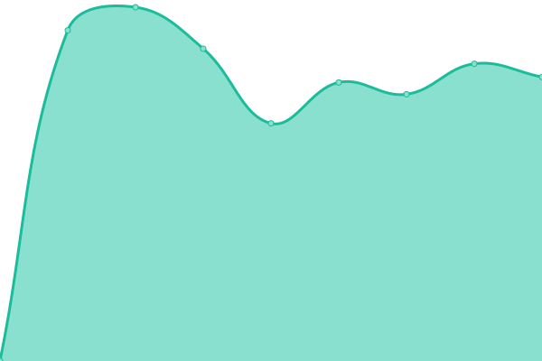
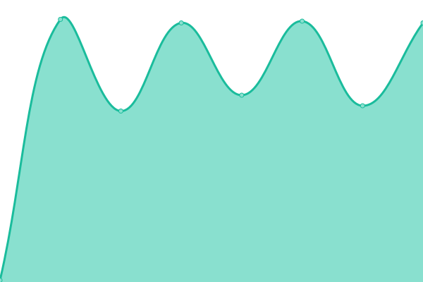

# [📈 Live Status](https://status.docktera.net): <!--live status--> **🟩 All systems operational**

This repository contains the open-source uptime monitor and status page for [Upptime](https://upptime.js.org), powered by [Upptime](https://github.com/upptime/upptime).

With [Upptime](https://upptime.js.org), you can get your own unlimited and free uptime monitor and status page, powered entirely by a GitHub repository. We use [Issues](https://github.com/upptime/upptime/issues) as incident reports, [Actions](https://github.com/mkevenaar-docktera/status.docktera.net/actions) as uptime monitors, and [Pages](https://status.docktera.net) for the status page.

<!--start: status pages-->
<!-- This summary is generated by Upptime (https://github.com/upptime/upptime) -->
<!-- Do not edit this manually, your changes will be overwritten -->
<!-- prettier-ignore -->
| URL | Status | History | Response Time | Uptime |
| --- | ------ | ------- | ------------- | ------ |
|  [DOCKTERA (www.docktera.com)](https://www.docktera.com) | 🟩 Up | [docktera-www-docktera-com.yml](https://github.com/mkevenaar-docktera/status.docktera.net/commits/HEAD/history/docktera-www-docktera-com.yml) | 

 1186ms
     
 | 

<a href="https://status.docktera.net/history/docktera-www-docktera-com">99.55%</a>
    

|  [DOCKTERA PaaS](https://app.jls.docktera.net) | 🟩 Up | [docktera-paa-s.yml](https://github.com/mkevenaar-docktera/status.docktera.net/commits/HEAD/history/docktera-paa-s.yml) | 

 824ms
     
 | 

<a href="https://status.docktera.net/history/docktera-paa-s">99.10%</a>
    

|  [DOCKTERA (my.docktera.com)](https://my.docktera.com) | 🟩 Up | [docktera-my-docktera-com.yml](https://github.com/mkevenaar-docktera/status.docktera.net/commits/HEAD/history/docktera-my-docktera-com.yml) | 

 2092ms
     
 | 

<a href="https://status.docktera.net/history/docktera-my-docktera-com">100.00%</a>
    

|  [DOCKTERA DNS 1](ns1.docktera.domains) | 🟩 Up | [docktera-dns-1.yml](https://github.com/mkevenaar-docktera/status.docktera.net/commits/HEAD/history/docktera-dns-1.yml) | 

 161ms
     
 | 

<a href="https://status.docktera.net/history/docktera-dns-1">100.00%</a>
    

|  [DOCKTERA DNS 2](ns2.docktera.domains) | 🟩 Up | [docktera-dns-2.yml](https://github.com/mkevenaar-docktera/status.docktera.net/commits/HEAD/history/docktera-dns-2.yml) | 

 134ms
     
 | 

<a href="https://status.docktera.net/history/docktera-dns-2">100.00%</a>
    

<!--end: status pages-->

[**Visit our status website →**](https://status.docktera.net)

## 📄 License

- Powered by: [Upptime](https://github.com/upptime/upptime)
- Code: [MIT](./LICENSE) © [Upptime](https://upptime.js.org)
- Data in the `./history` directory: [Open Database License](https://opendatacommons.org/licenses/odbl/1-0/)
